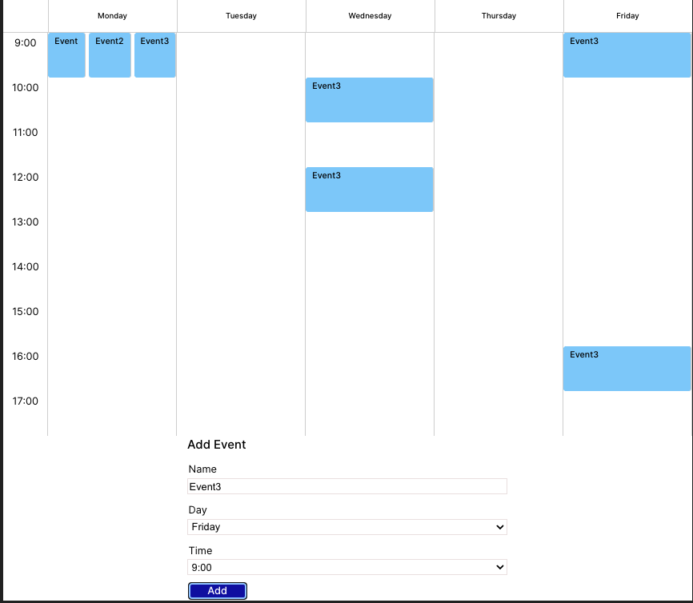

# React Calendar

Let us discover the ancient art of the lost calendar...


Structure of Calendar state is designed to make it simple to update in place

Schema

```json
{
  "day": {
    "hour": {
      "events": [{
        {
          name:"Event Name",
          duration:1 // this can be used to dynamically set pixes on class for meetings that are more than 1 hour
        }
      }]
    }
  },
  ...
}
```

Example

```json
{
  "monday":{
    "9:00":[
      {
        name: "Secret Valentine",
        duration: 1,
      }
      ]
    "10:00":[],
    ....
  }
}
```

## How To Run App

```bash
cd 

```


## Picture of outcome



## TODOs

### If meeting/event is more or less than one hour

- Set a max height on the event table data cell
- Write inline css to dynamically increase the size to determine where it falls on the page.

- For example

  - table data height is: 100px
  - event is 1.5 hours (90 mins)
    One normal 1 hour event means that each minute occupies (100/60)px of height
  - Simply multiply the duration of the event in minutes by the formula

  - 90 x (100/60) = 150px -> height pixels required
  - This will cause the event to overflow into the next row.
  - To ensure overflow I'll need to set a maximum height for the container otherwise it will likely expand

### Ensuring no overlaps on longer duration meetings

- This will likely require event-aware dynamic z-index and flexing.
